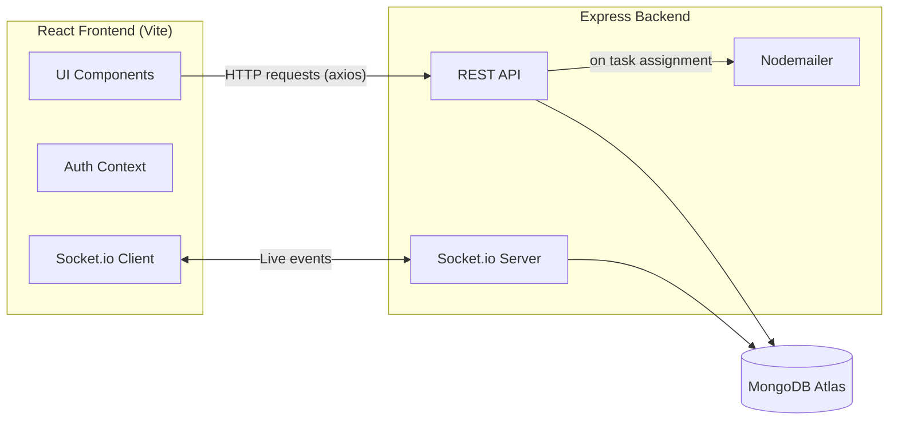
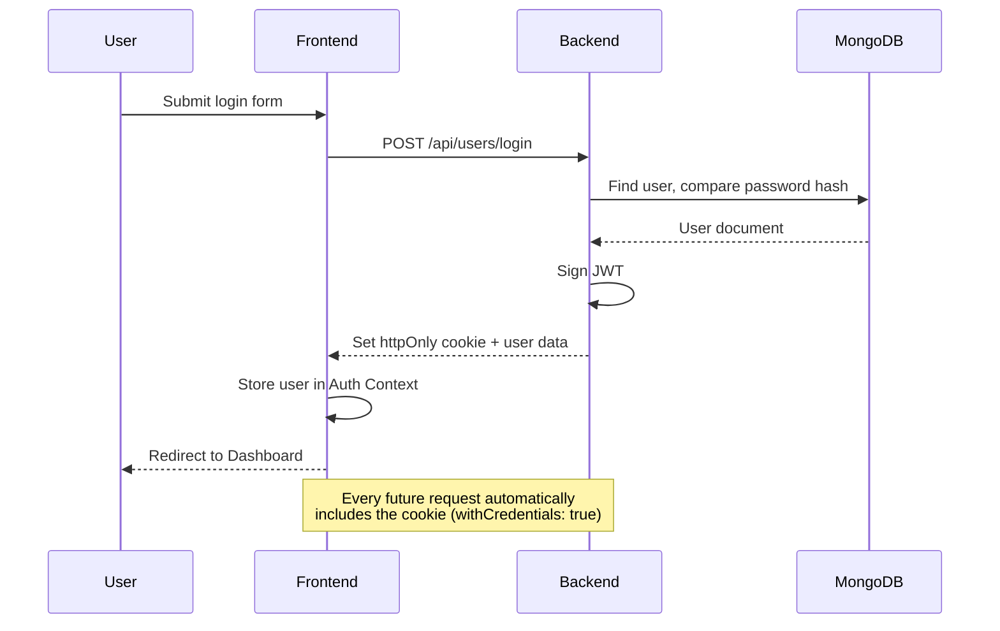
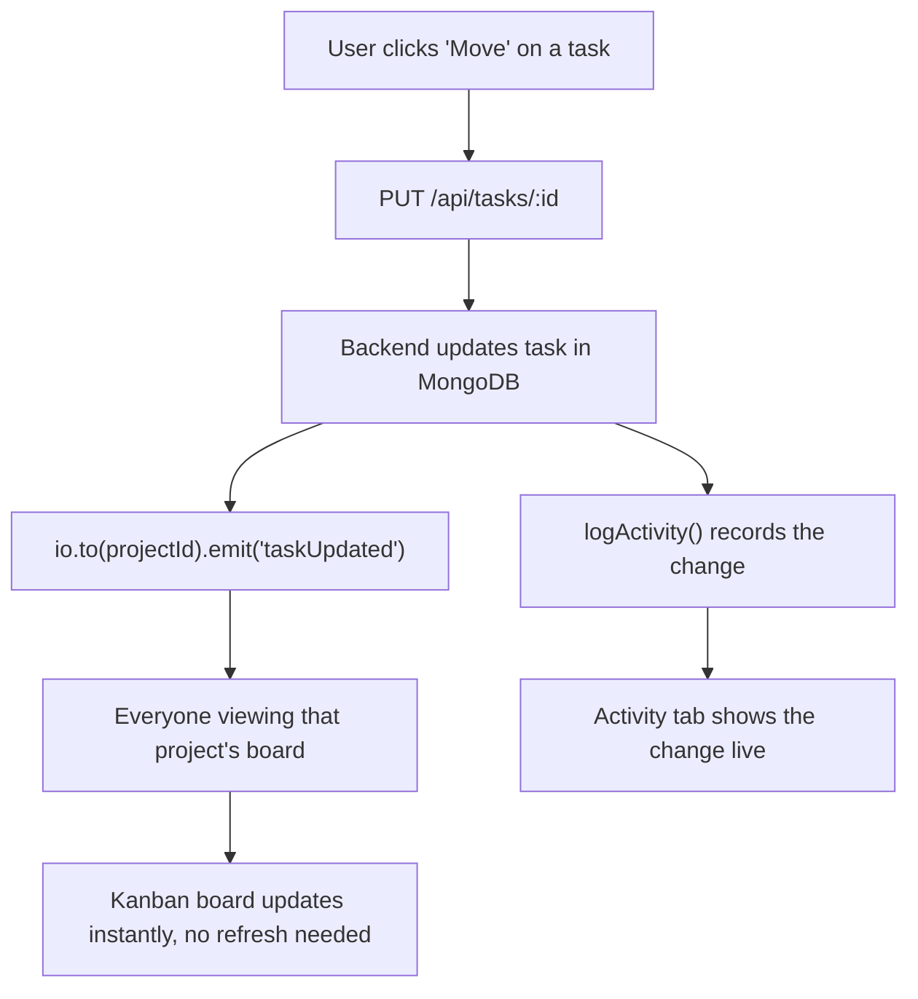

# 🗂️ TeamBoard

A full-stack, real-time collaborative task management application built with the MERN stack. Teams can create projects, assign tasks, track progress with live Kanban boards, and stay in sync through instant updates, comments, and an activity feed — no page refreshes needed.

## 🌐 Live Demo

👉 **Live Website:** https://teamboard-frontend.onrender.com

---

## ✨ Features

- **Authentication & Authorization** — JWT-based auth with httpOnly cookies, bcrypt password hashing
- **Role-based Access Control** — project Owner / Admin / Member roles with distinct permissions
- **Real-Time Kanban Board** — drag tasks through ToDo → In Progress → Done, synced live via Socket.io
- **Task Management** — priority levels, due dates, assignees, overdue detection
- **Search & Filter** — find tasks by keyword, status, or assignee instantly
- **Comments** — threaded discussion on every task, live-updating
- **Activity Log** — full audit trail ("Alex moved 'Fix login bug' to Done — 2 mins ago")
- **Email Notifications** — automatic emails when a task is assigned (Nodemailer)
- **Analytics Dashboard** — project/task breakdowns by status and priority (Recharts)
- **Team Member Insights** — per-person task completion and overdue tracking
- **Dark Mode** — full light/dark theme support, persisted across sessions
- **Fully Responsive** — mobile-first Tailwind design, usable on any screen size

---

## 🧱 Tech Stack

| Layer | Technology |
|---|---|
| Frontend | React (Vite), React Router, Tailwind CSS |
| Backend | Node.js, Express.js |
| Database | MongoDB with Mongoose |
| Real-time | Socket.io |
| Auth | JSON Web Tokens (JWT), bcryptjs, httpOnly cookies |
| Email | Nodemailer |
| Charts | Recharts |

---

## 🏗️ Architecture



---

## 🔐 Authentication Flow



---

## ⚡ Real-Time Task Update Flow



---

## 📁 Project Structure

```
task-manager/
├── backend/
│   ├── config/          → DB connection
│   ├── controllers/      → Route logic (auth, projects, tasks, comments, activity)
│   ├── models/            → Mongoose schemas (User, Project, Task, Comment, ActivityLog)
│   ├── routes/             → Express route definitions
│   ├── middleware/         → JWT auth middleware
│   ├── socket/              → Socket.io connection handler
│   ├── utils/                → Email sender, activity logger
│   └── server.js
└── frontend/
    ├── src/
    │   ├── components/    → Reusable UI (TaskCard, Navbar, charts, etc.)
    │   ├── pages/           → Dashboard, ProjectBoard, Login, Register
    │   ├── context/          → Auth & Theme (dark mode) context
    │   ├── services/          → API client, socket client
    │   └── styles/             → Tailwind + global CSS
    └── tailwind.config.js
```

---

## 🚀 Local Setup

### Prerequisites
- Node.js v18+
- A MongoDB Atlas account (free tier works)
- A Gmail account for email notifications (optional)

### Backend

```bash
cd backend
npm install
```

Create `backend/.env` (copy `.env.example`) and fill in:
```
PORT=5001
MONGO_URI=<your MongoDB Atlas connection string>
JWT_SECRET=<a long random string>
CLIENT_URL=http://localhost:5173
NODE_ENV=development
EMAIL_HOST=smtp.gmail.com
EMAIL_PORT=587
EMAIL_USER=<your gmail>
EMAIL_PASS=<gmail app password>
EMAIL_FROM=<your gmail>
```

```bash
npm run dev
```

### Frontend

```bash
cd frontend
npm install
```

Create `frontend/.env` (copy `.env.example`):
```
VITE_API_URL=http://localhost:5001
```

```bash
npm run dev
```

Visit **http://localhost:5173**.

---

## 📡 API Reference

### Auth
| Method | Endpoint | Description |
|---|---|---|
| POST | `/api/users/register` | Create an account |
| POST | `/api/users/login` | Log in |
| POST | `/api/users/logout` | Log out |
| GET | `/api/users/profile` | Get current user |

### Projects
| Method | Endpoint | Description |
|---|---|---|
| GET | `/api/projects` | List your projects |
| POST | `/api/projects` | Create a project |
| GET | `/api/projects/:id` | Get one project |
| PUT | `/api/projects/:id` | Update a project (owner only) |
| DELETE | `/api/projects/:id` | Delete a project (owner only) |
| POST | `/api/projects/:id/members` | Add a team member |
| PUT | `/api/projects/:id/members/:userId` | Change a member's role |
| DELETE | `/api/projects/:id/members/:userId` | Remove a member |

### Tasks
| Method | Endpoint | Description |
|---|---|---|
| POST | `/api/tasks` | Create a task |
| GET | `/api/tasks/project/:id` | List tasks for a project |
| PUT | `/api/tasks/:id` | Update a task (owner/assignee) |
| DELETE | `/api/tasks/:id` | Delete a task (owner only) |

### Comments & Activity
| Method | Endpoint | Description |
|---|---|---|
| GET | `/api/comments/task/:taskId` | Get comments on a task |
| POST | `/api/comments` | Add a comment |
| DELETE | `/api/comments/:id` | Delete a comment (author only) |
| GET | `/api/activity/project/:projectId` | Get project activity log |

---

## 🌐 Deployment

See [`DEPLOYMENT.md`](./DEPLOYMENT.md) for a full step-by-step guide to deploying this app on Render.

---

## 📄 License

MIT
